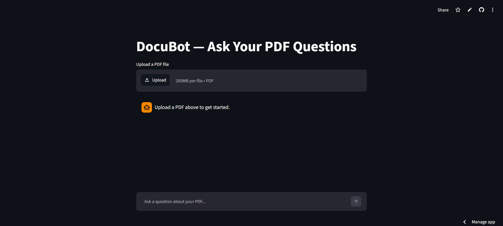

# DocuBot — PDF Question Answering with RAG

Ask natural language questions about any PDF document. DocuBot uses a **Retrieval-Augmented Generation (RAG)** pipeline to extract text from uploaded PDFs, store it as semantic embeddings in a vector [...]

🔗 **[Live Demo](https://datasciencechatbot-tw4dufj3rbsx78et47e6od.streamlit.app/)**



---

## How it works

```
PDF Upload  ──►  Text Extraction  ──►  Chunk & Embed  ──►  AstraDB Vector Store
                                                                    │
User Question  ──►  Semantic Search  ──►  Top-k Chunks  ──►  OpenAI LLM  ──►  Answer
```

1. A PDF is uploaded and its text is extracted page by page using PyPDF2
2. The text is split into overlapping chunks (800 tokens, 200 overlap) using LangChain's `CharacterTextSplitter`
3. Each chunk is embedded via OpenAI Embeddings and stored in **DataStax AstraDB** (a managed Apache Cassandra vector store)
4. When a question is asked, the most semantically relevant chunks are retrieved and passed to GPT as context
5. The LLM generates a grounded answer — not a hallucination — based only on the document

---

## Tech stack

| Layer | Technology |
|---|---|
| UI | Streamlit |
| PDF parsing | PyPDF2 |
| Text splitting | LangChain `CharacterTextSplitter` |
| Embeddings | OpenAI `text-embedding-ada-002` |
| Vector store | DataStax AstraDB (Apache Cassandra) |
| LLM | OpenAI GPT (via LangChain) |
| Orchestration | LangChain `VectorStoreIndexWrapper` |
| Secrets management | Streamlit Secrets |

---

## Getting started

### Prerequisites

- Python 3.9+
- An [OpenAI API key](https://platform.openai.com/api-keys)
- A free [DataStax AstraDB](https://astra.datastax.com/) account (create a Serverless Cassandra database)

### Installation

```bash
git clone https://github.com/aadityamishra2002/DatascienceChatbot.git
cd DatascienceChatbot
pip install -r requirements.txt
```

### Configuration

Create a `.streamlit/secrets.toml` file in the project root:

```toml
openai_api_key = "sk-..."
astra_db_token = "AstraCS:..."
astra_db_id = "your-database-id"
```

> Never commit this file — it's already in `.gitignore`.

### Run locally

```bash
streamlit run Chatbot.py
```

Open [http://localhost:8501](http://localhost:8501) in your browser.

---

## Usage

1. Upload any PDF using the file uploader
2. Wait for the "PDF processed" confirmation
3. Type your question in the chat input
4. DocuBot retrieves relevant passages from the document and answers accordingly

---

## Project structure

```
DatascienceChatbot/
├── Chatbot.py          # Main Streamlit app — RAG pipeline + chat UI
├── requirements.txt    # Python dependencies
└── .streamlit/
    └── secrets.toml    # API keys (not committed)
```

---

## Key concepts demonstrated

- **RAG architecture** — combining retrieval with generation to reduce hallucinations
- **Vector embeddings** — representing text as high-dimensional vectors for semantic search
- **Chunking strategy** — overlapping windows to preserve context across chunk boundaries
- **Managed vector database** — using AstraDB for scalable, production-ready vector storage
- **LangChain orchestration** — chaining retrieval and generation steps declaratively

---

## Potential improvements

- [ ] Support multiple PDF uploads simultaneously
- [ ] Add source citation — show which page/chunk the answer came from
- [ ] Swap in an open-source embedding model (e.g. `sentence-transformers`) to reduce API costs
- [ ] Add chat history memory so follow-up questions are context-aware
- [ ] Experiment with reranking (e.g. Cohere Rerank) for better retrieval accuracy

---
